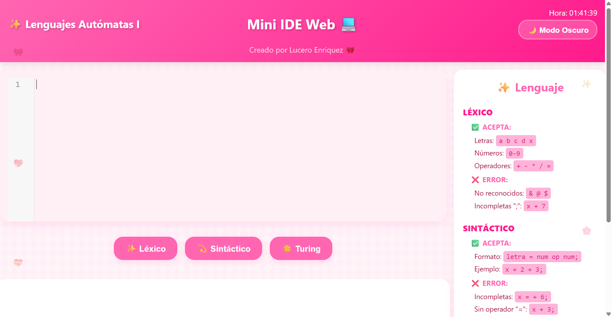
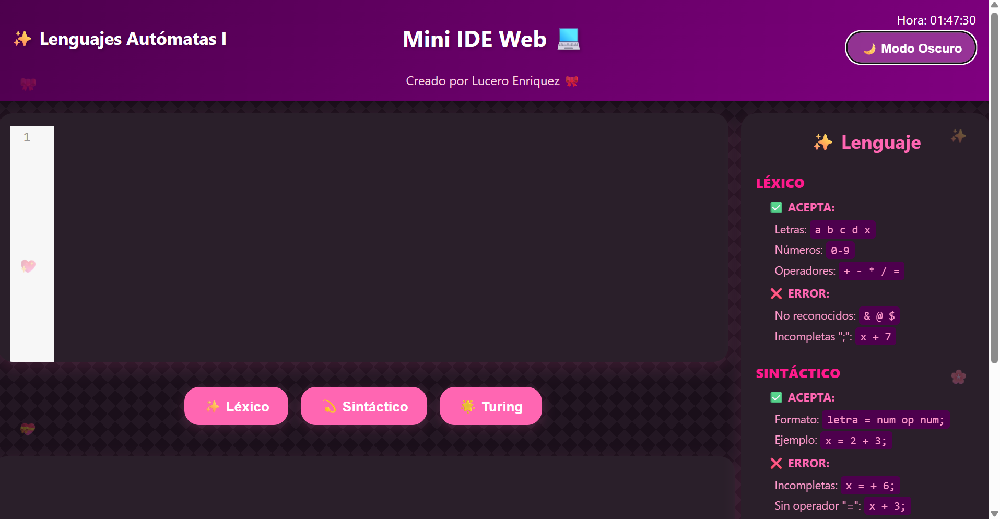
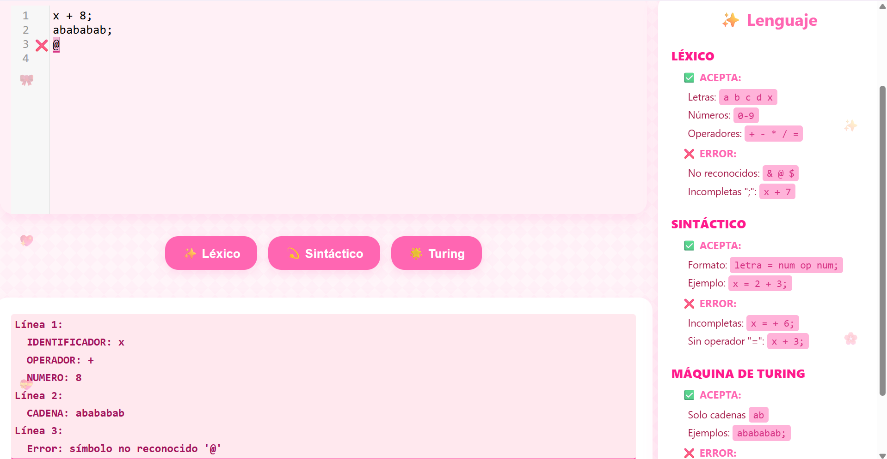
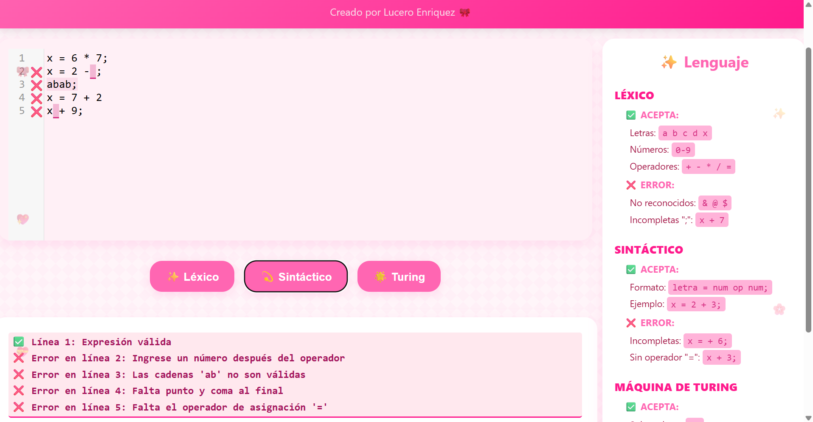
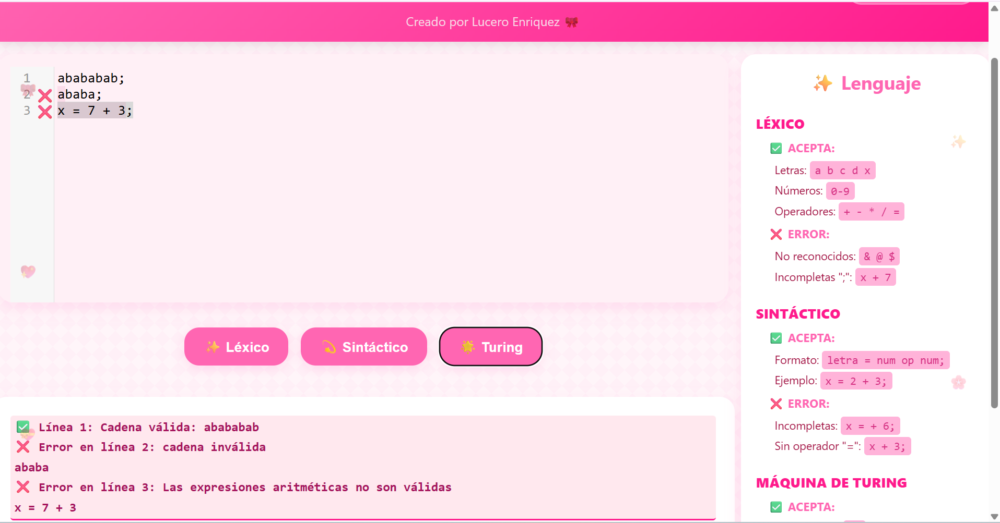

# 🌸 Mini IDE Web - Analizador Léxico, Sintáctico y Máquina de Turing 🎀

Un IDE web interactivo que implementa análisis léxico, sintáctico y una máquina de Turing, desarrollado con Flask y diseñado con una interfaz super kawaii y amigable ✨

## 👩‍💻 Datos del Estudiante 💖

- **Nombre:** Enriquez Torres Lucero 🌺
- **Materia:** Lenguajes y Autómatas I 📚
- **Profesor:** Molina Gomez Kevin David 👨‍🏫
- **Semestre:** 6to Semestre 🎓

## 🎨 Diseño de Interfaz 🌈

El Mini IDE Web presenta un diseño super bonito con una paleta de colores en tonos rosados y morados, creando una experiencia visual única y adorable:




## 🚀 Instrucciones de Ejecución ⭐

1. Asegúrate de tener Python 3.13 instalado 🐍
2. Instala las dependencias:
   ```bash
   pip install flask
   ```
3. Ejecuta el servidor:
   ```bash
   python app.py
   ```
4. Abre tu navegador en `http://localhost:5000` 🌐

## 📝 Especificación del Lenguaje 💫

### Análisis Léxico 🎯
- **Tokens válidos:**
  - Identificadores: `a, b, c, d, x,` ✨
  - Números: `0-9` 🔢
  - Operadores: `+, -, *, /, =` ➕
- **Errores léxicos:**
  - Símbolos no reconocidos: `@, &, $` ❌


### Análisis Sintáctico 🎨
- **Gramática:**
  ```
  expresion → identificador = numero operador numero;
  identificador → [a, d, x]
  numero → [0-9]+
  operador → [+-*/]
  ```
- **Errores sintácticos:**
  - Falta de operador de asignación ❌
  - Expresiones incompletas 🚫
  - Números faltantes 🔢
  - Falta de punto y coma 📝


### Máquina de Turing 🎮
- **Acepta:**
  - Cadenas formadas por pares de 'ab' ✅
  - Ejemplos: `ab;`, `abab;`, `ababab;` ✨
- **Rechaza:**
  - Cadenas impares ❌
  - Secuencias incorrectas 🚫
  - Otros caracteres 💫


## 🔧 Características Técnicas 💝

- **Frontend:**
  - Editor de código interactivo ✨
  - Resaltado de errores en tiempo real 🎯
  - Diseño bonito y organizado 🌈
  - Modo oscuro/claro 🌙☀️

- **Backend:**
  - Servidor Flask 🐍
  - Analizador léxico personalizado 🎨
  - Parser sintáctico 📝
  - Simulador de Máquina de Turing 🎮

## 🎯 Funcionalidades Principales 🌟

1. **Análisis Léxico:**
   - Identificación de tokens ✨
   - Detección de errores léxicos 🚫
   - Resaltado de símbolos no reconocidos ❌

2. **Análisis Sintáctico:**
   - Validación de estructura ✅
   - Detección de errores de sintaxis 🚫
   - Mensajes de error descriptivos 💭

3. **Máquina de Turing:**
   - Validación de cadenas ab ✨
   - Visualización de errores 🎯
   - Marcado de posición exacta del error 📍

## 📋 Requisitos del Sistema 🎀

- Python 3.13 🐍
- Flask 🌸
- Navegador web moderno 🌐
- Conexión a internet (para CDN de CodeMirror) 💫

## 🤝 Contribuciones 🌟

Este proyecto fue desarrollado como parte de la materia de Lenguajes y Autómatas I. Las mejoras y sugerencias son bienvenidas 💝

<p align="center">
  
</p>

---
Desarrollado con 💖 por Lucero Enriquez ✨
